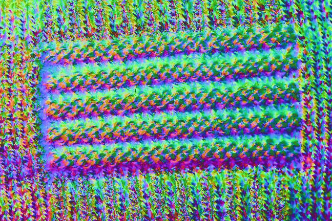
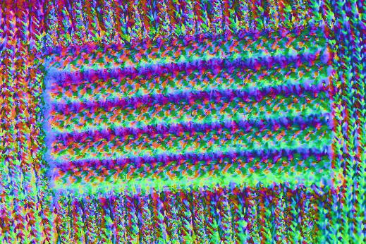
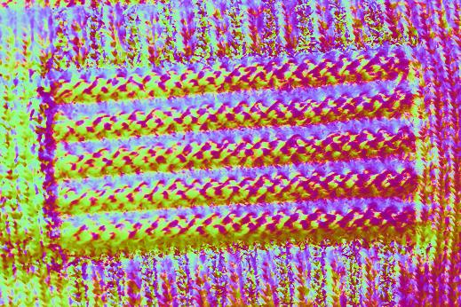
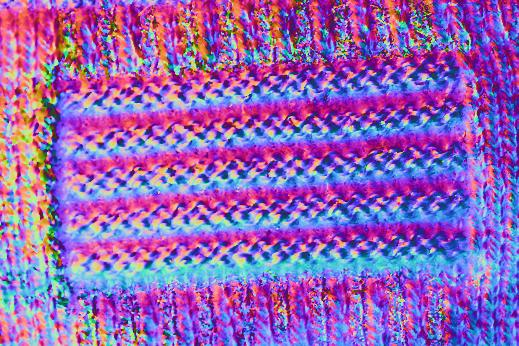
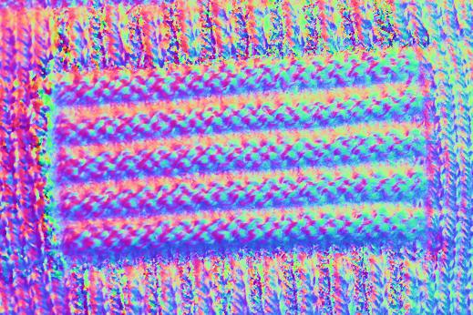

# Preliminary Test Results 

* pnormal2.jpg : Reference result without robust PCA (outlier filtering method, like shadow or specularity). Out-dated data (without the darkroom setup) is used.
  * 
* robust_pnormal2.jpg :  Reference result with robust PCA. Out-dated data (without the darkroom setup) is used. 
  * 
* Robust<#1>_ch<#2>_chrome<#3>_svd<#4>_beta<#5>.jpg :  Up-to-date result with the darkroom setup data and varying parameters. 
  * Format
    * #1: {0: no robust method, 1: robust PCA (truncated nuclear norm) with rank 3 constraint, 2: robust PCA (bayesian)
    * #2: used color channel ID {1: R, 2: G, 3:B}
    * #3: chormacity removal {0: no, 1: yes}
    * #4: svd method {0: ranomized svd, 1: svd}
    * #5: robust PCA parameter (sparisty balance)
      * 
      * 
      * 
