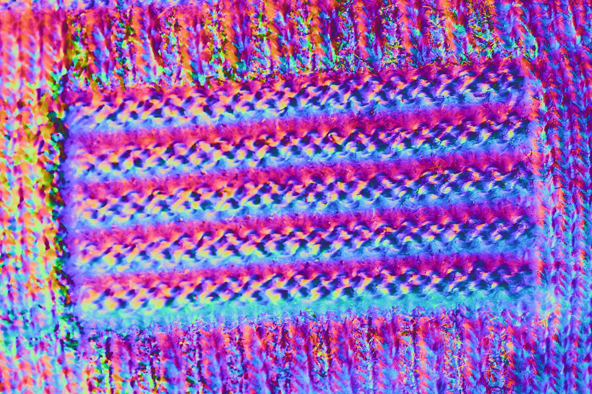

# Preliminary Test Results 

## Note
*   The used color coding is not absolutely comparable to different experiments due to relativeness.
*   Since there was no ambient light image, I subtracted a mean intensity image from every image, which is bad. Also, a darker room setup is largely favored (we can use a cardboard box)
*   Since it is uncalibrated, deviations among normals are not scaled properly. This yields inconsistent color coding.
*   Since it is uncalibrated, surface normals are not physically plausible but have a clustering effect at least.
*   Since the lights have diverse directions along the horizontal direction but narrow (redundant) vertical directions, surface normals are distinctive along the horizontal dir. but not along the vertical dir.
*   For shadow, due to the above reason, shadows by the pattern structure are consistently observed in almost all the images. This makes the robust algorithm not effective in this case.
*   The robust algorithm (Robust PCA based) can be significantly improved by light calibration with more diverse light directions (without changing the number of LEDs).
*   In this regard, for the test pattern case, capturing the pattern with a rotation of 90 degrees would lead to a better distinctive normal result. However, it couldn't be generalized because it must depend on the pattern structure.

## Results
* pnormal2.jpg : Reference result without robust PCA (outlier filtering method, like shadow or specularity). Out-dated data (without the darkroom setup) is used.
  * 
* robust_pnormal2.jpg :  Reference result with robust PCA. Out-dated data (without the darkroom setup) is used. 
  * 
* Robust<#1>_ch<#2>_chrome<#3>_svd<#4>_beta<#5>.jpg :  Up-to-date result with the darkroom setup data and varying parameters. 
  * Format
    * #1: {0: no robust method, 1: robust PCA (truncated nuclear norm) with rank 3 constraint, 2: robust PCA (bayesian)
    * #2: used color channel ID {1: R, 2: G, 3:B}
    * #3: chormacity removal {0: no, 1: yes}
    * #4: svd method {0: ranomized svd, 1: svd}
    * #5: robust PCA parameter (sparisty balance)
      * robust0_ch2_chrome0_svd1_beta1.jpg: 
      * robust1_ch2_chrome0_svd1_beta1.jpg: 
      * robust1_ch2_chrome0_svd1_beta0.5.jpg: 
